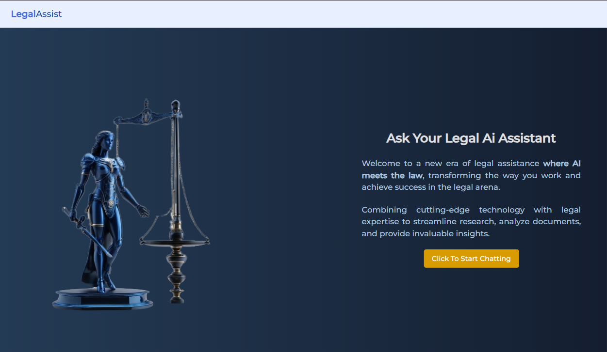
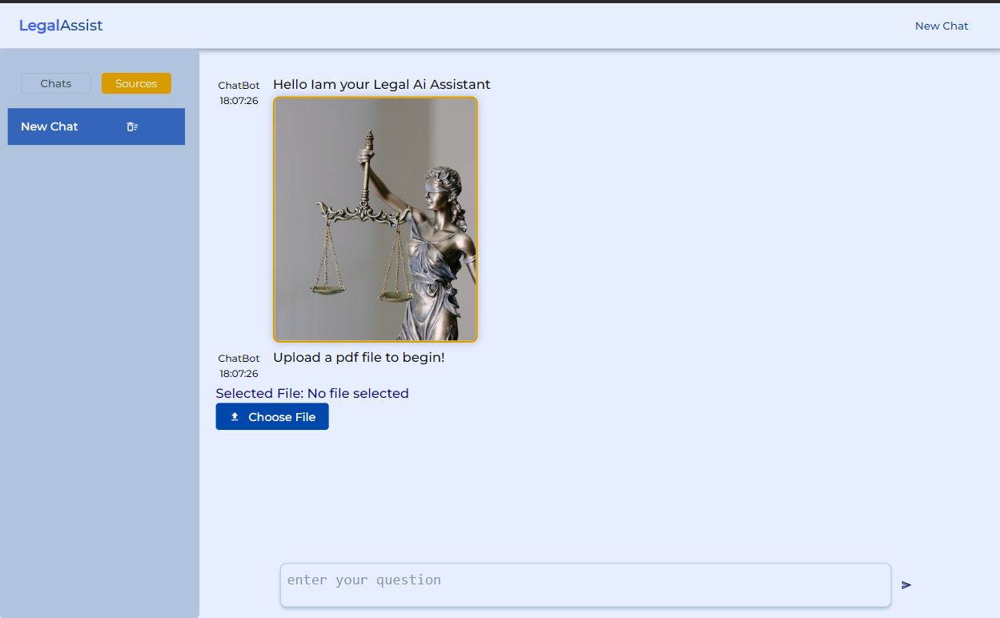
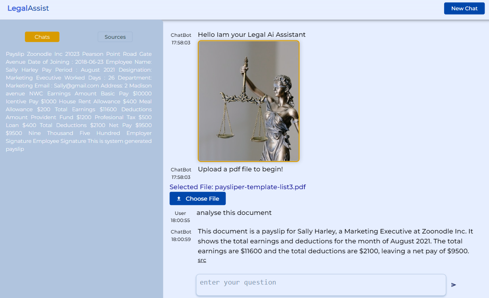

# legal-ai-assistant
## anonymize.py
Anonymizing text files by identifying and extracting different types of PII from text data and replacing sensitive information with generic placeholders or pseudonyms using Microsoft Presidio
## utils.py
Helper functions for converting pdf file to txt using pdfplumber and reading from txt files  
## installing requirements using pip
pip install -r requirements.txt
## To run the APP locally
  In order to make the full App works on the user's local machine, It's required to launch the api first then running the frontend by executing the scripts below:  
  ### To run the API      
    uvicorn app.api.main:app --reload  
  
 ### To run the frontend   
     cd frontend  
     yarn install  
     yarn start

  

## Link to the deployed API  
- https://legalassist.onrender.com
